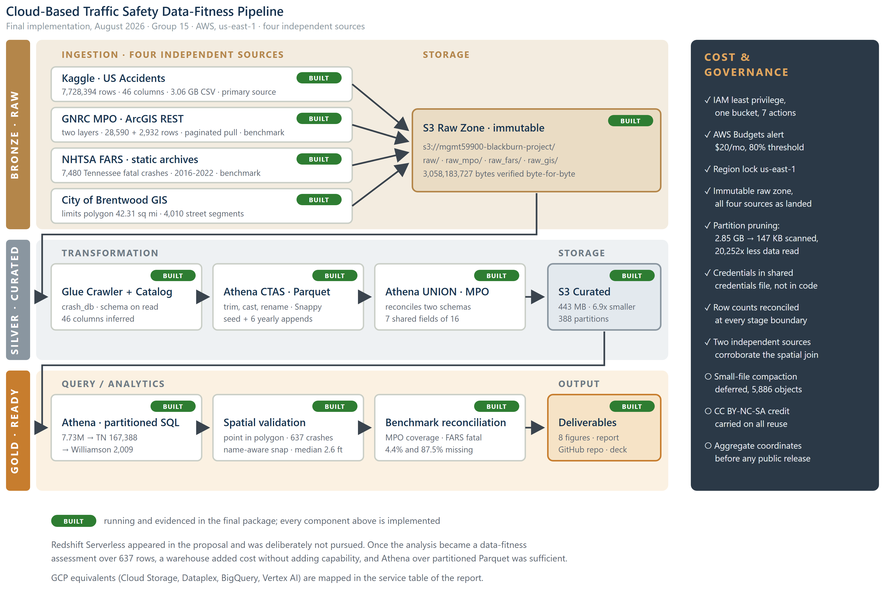

# When the Data Is Not Fit for the Question

A cloud data-fitness assessment of public crash data for Brentwood, Tennessee.

**MGMT 59900: Big Data Analytics in the Cloud** | Purdue MSBA | Group 15
Kevin Blackburn, P.E., GISP

---

## What this project is

This started as a plan to rank crash locations in Brentwood so the City could
target local traffic safety funding. Spatial validation and two independent
benchmarks showed the primary dataset cannot support that decision, so the
deliverable became a **data-fitness assessment** with a sourcing recommendation.

The same pipeline that exposed the problem also answered the underlying
strategic question: the crash burden Brentwood records is overwhelmingly on
roads Brentwood does not maintain.

### Headline findings

| Finding | Number |
|---|---|
| Crash burden on TDOT facilities, inside the corporate limits | **612 of 637, or 96.1%** |
| Coverage of the national dataset against the regional MPO, 2016-2020 | **4.4%** (281 vs 6,394) |
| Fatal crashes missed by the national dataset | **87.5%** (2 of 16 present) |
| Fatal crashes on municipal streets, where the City has authority | **6 of 16** |
| Error rate of name-based geographic filtering | **29.9%** |
| Total AWS cost of the pipeline | **$0.18 gross, $0.00 net** |

**Recommendation:** source crash analytics from GNRC MPO open data rather than
the national dataset, pursue TITAN access through Brentwood Police Department,
and direct safety effort at MPO and TDOT funding advocacy rather than local
capital projects.

---

## Architecture



A bronze, silver, and gold medallion pattern on AWS in `us-east-1`. Four
independent sources land immutable in S3. Glue crawls them into a catalog,
Athena transforms them into partitioned Parquet, and the analytical layer runs
SQL plus a geospatial step.

| Layer | Service | What happens |
|---|---|---|
| Bronze | S3 | Four sources landed exactly as delivered, never edited in place |
| Silver | Glue Catalog, Athena CTAS | CSV to Snappy Parquet, 388 partitions, 6.9x smaller |
| Silver | Athena `UNION ALL` | The two GNRC layers reconciled onto one schema in SQL |
| Gold | Athena, geopandas | Partitioned SQL, point-in-polygon, benchmark reconciliation |

Redshift Serverless appeared in the proposal and was **deliberately not built**.
Once validation cut the analytical universe to 637 rows, a warehouse added
standing cost without adding capability.

### Data sources

| Source | Scope | Volume | Role |
|---|---|---|---|
| Kaggle US Accidents | 49 states, 2016 to Mar 2023 | 7,728,394 rows, 3.06 GB | Dataset under assessment |
| GNRC MPO open data | Nashville region, 2010-2020 | 31,522 rows in the envelope | Coverage benchmark |
| NHTSA FARS | Tennessee, 2016-2022 | 7,480 fatal crashes | Fatal-crash benchmark |
| City of Brentwood GIS | Limits and street network | 1 polygon, 4,010 segments | Spatial ground truth |

---

## Repository layout

```
data/derived/     analysis-ready extracts produced by the scripts below
data/gis/         city limits polygon and street centerlines (GeoJSON)
docs/             data inventory and the architecture diagram source
evidence/         console screenshots: S3, Athena, catalog, billing
figures/          every figure used in the report and presentation
scripts/          the Python pipeline, in run order
sql/              Athena DDL and analysis SQL
```

The **3.06 GB raw CSV is not in this repository.** It is redistributed under
CC BY-NC-SA and is too large for Git. Download it from
[Kaggle](https://www.kaggle.com/datasets/sobhanmoosavi/us-accidents) if you want
to rebuild from raw.

---

## Setup

```bash
python -m venv venv
source venv/Scripts/activate     # Windows Git Bash
pip install -r requirements.txt
```

AWS credentials are read from the shared credentials file and are never stored
in this repository. Point boto3 at yours and use a named profile:

```bash
export AWS_SHARED_CREDENTIALS_FILE="$HOME/.aws/credentials"
```

---

## How to reproduce

### Verify every published number

The fastest way to confirm the findings. This recomputes each figure quoted in
the report from the derived extracts and the City GIS, and asserts it:

```bash
python scripts/verify_findings.py
```

Expected output ends with `36 passed, 0 failed`. If any assertion fails, a
number in the writeup is wrong.

### Rebuild from source

Scripts run in this order. Steps 1 to 4 hit external APIs and need network
access; steps 5 onward work from the committed extracts.

| # | Script | What it does |
|---|---|---|
| 1 | `fetch_gis.py` | Pulls the city limits polygon and street centerlines |
| 2 | `validate_polygon.py` | Sanity-checks the polygon before anything trusts it |
| 3 | `fetch_mpo.py` | Paginated pull of the two GNRC layers |
| 4 | `fetch_fars.py` | Downloads NHTSA FARS annual files |
| 5 | `land_raw_mpo.py` | Lands both GNRC layers in the S3 bronze zone as delivered |
| 6 | `unify_mpo.py` | Local reference implementation of the Athena union |
| 7 | `spatial_join_v2.py` | Point-in-polygon plus name-aware centerline snapping |
| 8 | `analysis_gis.py` | Jurisdiction and timing analysis |
| 9 | `mpo_compare.py` | Coverage comparison against the MPO benchmark |
| 10 | `fars_compare.py` | Fatal-crash comparison against FARS |
| 11 | `dedup_audit.py` | Duplicate audit across every source |
| 12 | `build_charts.py`, `build_figures.py` | Regenerate all figures |

### Run the cloud SQL

`sql/02_silver_union_mpo.sql` builds the MPO silver layer in Athena and ends
with a point-in-polygon query using `ST_Contains`. Run statements one at a time;
Athena does not accept a multi-statement paste. The CTAS fails if its S3
destination already holds objects, so empty `curated_mpo/` before re-running.

---

## How to interpret the results

Four points matter when reading the numbers.

**Severity is not injury.** The `Severity` field in US Accidents encodes traffic
impact, meaning the delay a crash caused. It is never a measure of harm here.

**Coverage grew, risk did not.** Recorded crashes rose 16-fold from 2016 to
2022. That is expanding sensor coverage. Any trend analysis on this dataset
reports a safety crisis that does not exist.

**Only 2016 to 2019 is a clean comparison window.** The MPO benchmark also ramps
in its early years, with 7 records in 2010 and 40 in 2011.

**The benchmark has its own limits.** The two GNRC layers share only 7 of 16
fields. Collision manner and injury severity exist for one year, 2020, which is
also the pandemic year with depressed volumes.

### Why the findings are trustworthy

Three independent checks back the spatial method:

1. **Two independent sources agree year by year.** GNRC and FARS report
   identical fatal crash counts inside the limits for 2017 through 2020: 4, 2,
   2, 3. Four for four, from agencies using different collection processes.
2. **Two independent geometry engines agree.** The point-in-polygon test was run
   in Athena with `ST_Contains` and locally with geopandas. Both return 9,837
   crashes inside the limits, matching across all eleven years.
3. **Row counts reconcile exactly at every stage boundary**, which is the check
   that catches silent truncation.

---

## Cost

The entire pipeline billed **$0.18 gross and $0.00 net** after Free Tier
credits. Attribution is by service and period: no other coursework used Athena
or Glue in the August billing period.

| Service | Usage | Gross |
|---|---|---|
| Amazon Athena | 0.025 TB scanned | $0.13 |
| Amazon S3 | 6,881 PUT, 0.211 GB-month | $0.03 |
| AWS Glue | 0.043 crawler DPU-hours | $0.02 |

Partitioning cut a single state query from **2.85 GB to 147.47 KB scanned**, a
20,252-fold reduction. Athena bills a 10 MB minimum per query, so the **billed**
reduction is 292-fold. Both numbers are stated because reporting only the larger
one overstates the saving roughly seventyfold.

One governance finding worth more than the cost: because credits zero out the
net bill, a default AWS Budgets alert tracks a number that is always $0.00 and
**would never fire**. On a credited account the only working control is gross
usage — TB scanned, DPU-hours, request counts.

---

## Generative AI use

Claude was used for code assistance, debugging, editing, and diagram
construction, including first drafts of the spatial validation and benchmark
scripts and the SVG source for the architecture diagram.

Everything was verified against the data rather than accepted as generated. Two
corrections illustrate the process. The road jurisdiction classification was
wrong twice and was corrected from professional knowledge of the network. A
claimed corroboration between GNRC and FARS — that both reported 16 fatal
crashes — did not survive checking, because those are different units over
different windows and the match was coincidence; the year-by-year comparison
replaced it and is a stronger result.

`scripts/verify_findings.py` exists so that no number in the writeup has to be
taken on trust.

---

## License and attribution

Analysis code in this repository is provided for academic review. The US
Accidents dataset is redistributed by its authors under **CC BY-NC-SA 4.0** and
is not included here. GNRC MPO and NHTSA FARS data are public records. City of
Brentwood GIS data is published by the City.

> Moosavi, Sobhan, et al. *A Countrywide Traffic Accident Dataset.* 2019.
